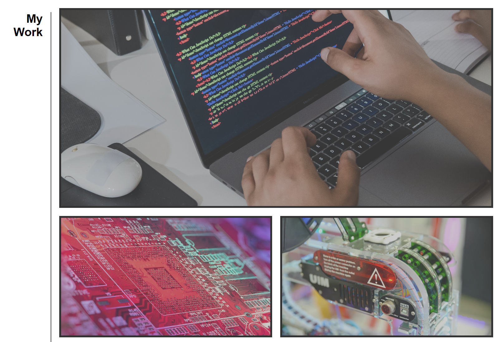

# Online Portfolio 

## Description
This projects serves to act as an online collection of all projects and published work completed by myself. As I publish more content, and have more projects to show for myself, I will update the page as well, so that all such information can be found easily within one place that is accessible to anybody. This project was built to provide such content in an clean and easy way for anybody with access to the internet to access, and also to provide a personal touch over the front-end of the design. The portfolio itself showcases what I can do as a front-end developer, while simultaneously acting as a resource for which other pertinent information regarding my capabilities can be accessed and presented. 
Having the information presented in this manner solves the issue of having to put together a document containing my professional experience, and contact information for each individual recruiter. Furthermore, it is easier for users and viewers to access from their end, and refer back to if need be. 
I have learnt the importance of mapping out different aspects of a webpage prior to coding, so that I have a clear understanding of how to target the behaviour of parent and child elements. Through this project I have learnt why certain principles, such as flexbox is preferrable in certain situations (such as this project) over absolute and relative positioning. Through my usage of the flex principle I have been better able to comprehend the relationship with parent and child elements. 

## Installation
This project can be accessed on any web browser, when the desployed URL under the Github domain is input into the address bar. 

## Usage
At the header of the page at the top left is my full name, which is acting as the title of the page itself. 
Links can be found on the top left of the page on the nav bar, and will direct the user to the section of the page with the respective section with that title. 
The links appear white at first, then will appear grey after they have been clicked so as to provide the user with the sense of progress as they navigate the page. 
    ```md
    
    ```
The "About Me" section contains an image of me, along with a quick introduction to my professional and personal background. I have included a fun fact so as to provide a "human" touch to the portfolio, reminding the user there is a person behind it. 

The "My Work" section is a collection of content which will be replaced with actual projects when I complete them. The colors are not saturated at first, but when the user's cursor hovers over the item, the project title will appear on the bottom-left section, and the image color is saturated to its full capacity.This allows an interactive and responsive usage for the user, as opposed to appearing static.  
    ```md
    
    ```
The "Contact Me" section is at the bottom of the page, and provides links to outside pages. The links are underlined so the user knows they are there as links. The links are black before they are clicked, and then will change color to pink when being clicked, and then to dark grey after the linked page as already been visited via the link. This color change is to provide interactivity for the user, as well as providing them with a clear idea of which links have or have not been accessed yet. 
    ```md
    
    ```
## Credits
All background and body images have been found on Pexels.com. They have either been saved from or linked through: https://www.pexels.com/search/technology/. 

The only picture I own myself is the image of me, is the only one not from Pexels.com. File: (./assets/me.jpg) 

## License
N/A


